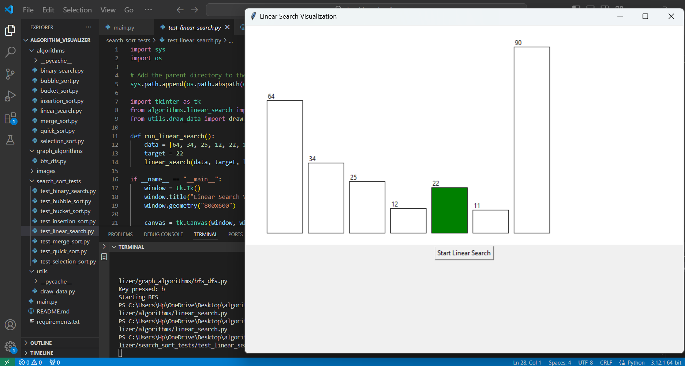
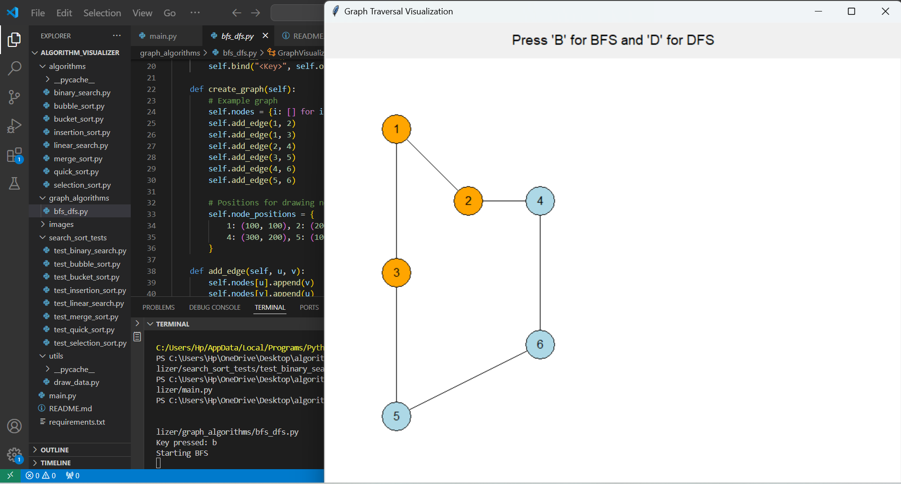

# Algorithm Visualizer

Welcome to the Algorithm Visualizer! This project is designed to help you understand and visualize various sorting and searching algorithms, as well as graph traversal algorithms like BFS and DFS. The visualizations are created using Tkinter, a Python GUI library, making the learning process interactive and engaging.

## Example Visualizations

